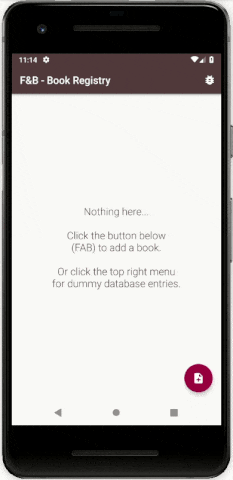

<h1 align="center">Flourish & Blotts - Book Registry</h1>

<strong>Inventory app for the Harry Potter universe</strong>
 First app with data storing capabilities 📱🗃✨

 

</img>

<h2>About</h2>
Final student project made in 2017-2018 as part of <a href="https://eu.udacity.com/course/android-basics-nanodegree-by-google--nd803" target="_blank">Udacity's Android Basics Nanodegree</a>.

<h3>☑️ Phase 1 - (Nov. - Feb.):</h3>

1. <a href="https://github.com/r4dixx/LiterallyHelloWorld" target="_blank">Literally Hello World</a>
2. <a href="https://github.com/r4dixx/HelloAndroid" target="_blank">Hello Android</a>
3. <a href="https://github.com/r4dixx/CheesyWinterContest" target="_blank">Cheesy Winter Contest</a>
4. <a href="https://github.com/r4dixx/m32O" target="_blank">m32O</a>

<h3>☑️ Phase 2 - (Feb. - Jul.):</h3>

1. <a href="https://github.com/r4dixx/RookiePlayer" target="_blank">Rookie Player</a>
2. <a href="https://github.com/r4dixx/VisitCalgary" target="_blank">Visit Calgary</a>
3. <a href="https://github.com/r4dixx/TheGuardianView" target="_blank">The Guardian View</a>
4. <strong><a href="https://github.com/r4dixx/Flourish-And-Blotts-Book-Registry" target="_blank">Flourish & Blotts - Book Registry</a></strong>

<h2>Goal and requirements</h2>

Build an inventory app allowing the user to add products, edit product detail and see a list of all products.

Each product contains the following values: Product Name, Price, Quantity, Supplier Name, and Supplier Phone Number.

Each product has a sale button that decrements the quantity by one, both in the "details" and "all products" screens.

Include sanity checks (no negative quantities, no empty values, etc.) and empty state view(s).

<h2>Key learnings</h2>

- Android SQLite Database
- SQLiteOpenHelper
- Java contracts
- ContentValues
- ContentProvider
- ContentResolver
- Cursor
- Sanity checks
- Dialog
- Spinner
- FAB

<h2>Installation</h2>

1. Download this project as zip and extract it
2. Import it in Android Studio
3. Sync Gradle and run on your device/emulator

Or use <a href="https://github.com/cesarferreira/dryrun" target="_blank">`dryrun`</a> by <a href="https://github.com/cesarferreira" target="_blank">@CesarFerreira</a>

<h2>Contributing</h2>

This project is open to suggestions and improvements. Simply create a Pull Request and I'll have a look.

<h2>Project status</h2>

Open to translations, code improvements, feature suggestions... Any contribution is most welcome!

<h2>Credits</h2>

- Author: <a href="https://twitter.com/r4dixx" target="_blank">Amaël Sikel</a>
- Icon made by <a href ="https://openclipart.org/detail/289671/books" target="_blank">Doom</a>
- Miscellaneous ideas from the Harry Potter Wiki entry <a href="http://harrypotter.wikia.com/wiki/Flourish_and_Blotts" target="_blank">"Flourish and Blotts"</a>
- Color palette based on <a href="https://vignette.wikia.nocookie.net/harrypotter/images/a/a8/Flourish_and_Blotts_sign.jpg/revision/latest?cb=20091026005244" target="_blank">this unofficial logo</a>
- <a href="https://gitmoji.carloscuesta.me/" target="_blank">Gitmoji</a>, an emoji guide for your commit messages by <a href="https://github.com/carloscuesta" target="_blank">carloscuesta</a>

<h2>Copyright</h2>
This project is licensed under the terms of the MIT license and protected by Udacity Honor Code and Community Code of Conduct. See <a href="LICENSE.md">license</a> and <a href="LICENSE.DISCLAIMER.md">disclaimer</a>.
